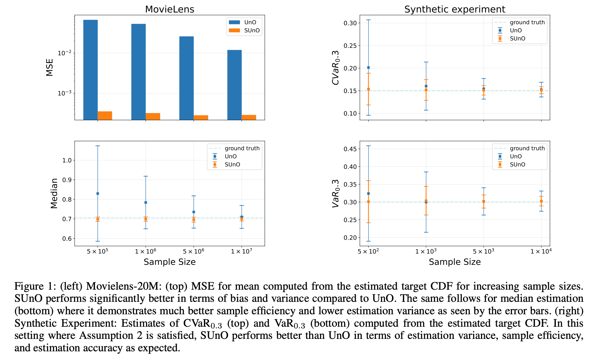
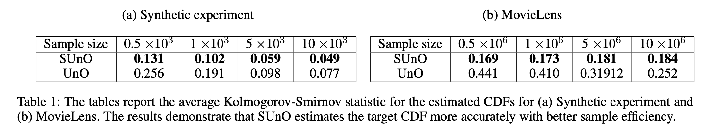

# SUnO: Distributional Off-Policy Evaluation for Slate Recommendations

This repository contains the code for the paper *Distributional Off-Policy Evaluation for Slate Recommendations* that appears in The 38th Annual AAAI Conference on Artificial
  Intelligence (AAAI-24).

Link: https://arxiv.org/abs/2308.14165

## Installation

To install this package, first create a new conda environment with the right libraries and Python version:

```
conda env create -f environment.yaml
```

Activate the new environment:
```
conda activate suno
```

All dependecies required to run the code should be installed. Any extra packages can be installed with `pip`.

## Structure

There are two simulators in this code repository:
1. Movielens Simulator: On [Movielens-20M](https://grouplens.org/datasets/movielens/20m/) data
2. OBP Simulator: Using the [Online Bandit Pipeline](https://github.com/st-tech/zr-obp)

Each is present under the corresponding folder named `<name>_simulator`. The folders all have the structure
```
<name>_simulator/
    - __init__.py
    - settings.yaml
    - simulator.py
    - runner.py
```
`simulator.py` defines the simulator and `settings.yaml` sets arguments for running experiments.

The folder `utils` contrains the code for defining the estimators (UnO, SUnO, etc.) and metrics to be computed from the CDF (mean, CVaR, etc.)

The reward generating distribution for the Synthetic Experiments is under `synthetic_exp`.

## Run Experiments 
Experiments can be run from each corresponding folder with 
```python runner.py```
and the experiments arguments can be set from `settings.yaml`. All arguments are self-explanatory or have been described in the code.

For the synthetic experiment, the reward distribution can be used for generating data to run the experiments.

## Results
Experiments details may be found in under Empirical Analysis in the paper.






## Bibliography

```bash
@article{chaudhari2023distributional,
  title={Distributional Off-Policy Evaluation for Slate Recommendations},
  author={Chaudhari, Shreyas and Arbour, David and Theocharous, Georgios and Vlassis, Nikos},
  journal={arXiv preprint arXiv:2308.14165},
  year={2023}
}
```